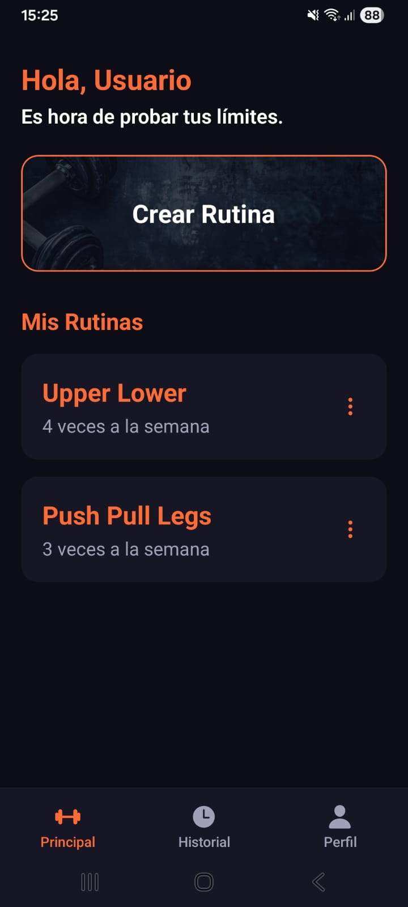
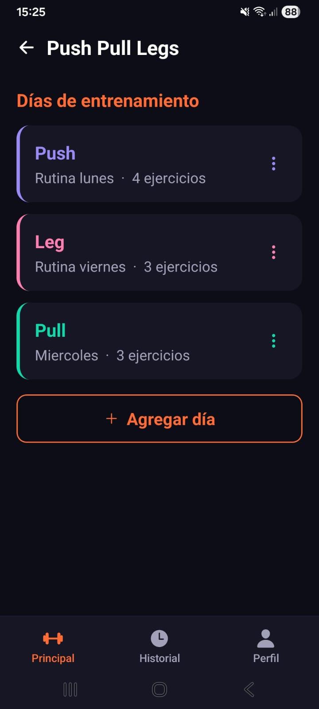
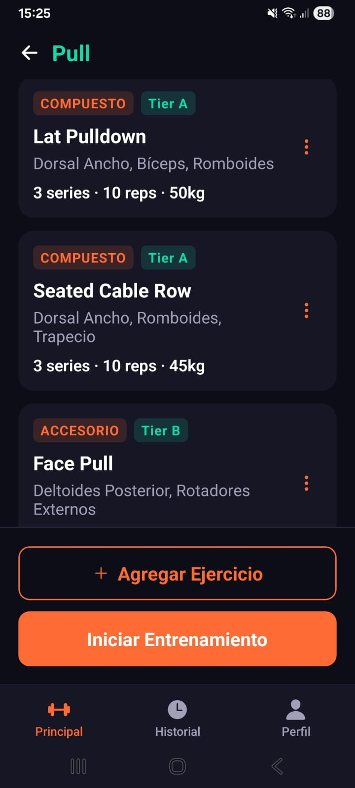
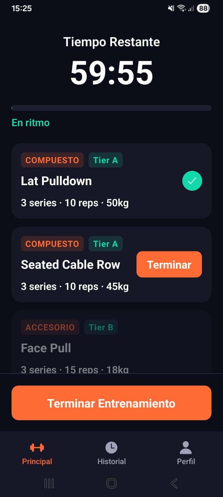
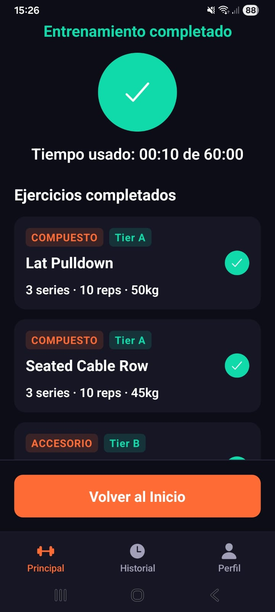
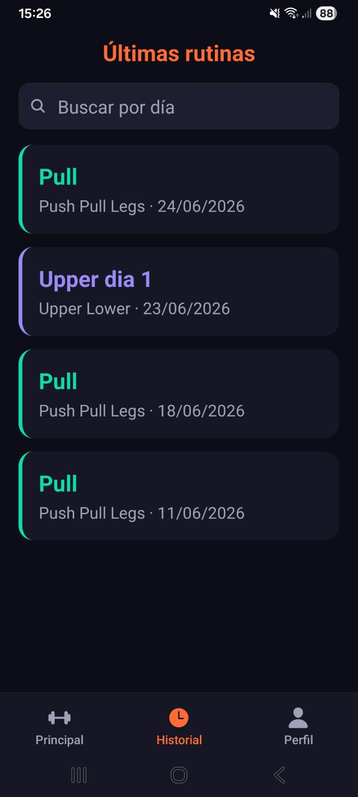

# ClockFit ⏱️

**ClockFit** es una aplicación móvil de gimnasio construida alrededor de un sistema de entrenamiento basado en tiempo. A diferencia de las apps de fitness tradicionales, que solo registran datos, ClockFit permite al usuario elegir cuánto tiempo tiene disponible y estructura el entrenamiento para terminar dentro de ese tiempo, con un temporizador en vivo que guía la sesión.

---

## 📋 Tabla de contenidos

- [Características](#-características)
- [Capturas de pantalla](#-capturas-de-pantalla)
- [Instalación](#-instalación)
- [Uso](#-uso)

---

## ✨ Características

- **Entrenamiento por tiempo (ClockFit Activo):** el usuario elige una duración y entrena con un temporizador en vivo y una barra de progreso con estados de ritmo.
- **Creador de rutinas:** organización en tres niveles — Rutinas → Días → Ejercicios.
- **Catálogo de ejercicios:** 35 ejercicios clasificados por grupo muscular, tipo (compuesto/accesorio) y prioridad (Tier A/B).
- **Personalización por serie:** cada ejercicio permite editar series individuales con sus reps y peso.
- **Descanso entre ejercicios:** modal de descanso con cuenta regresiva al terminar cada ejercicio.
- **Historial de entrenamientos:** registro de cada sesión completada, con buscador por día para revisar el progreso.
- **Perfil de usuario:** datos personales editables (nombre, edad, peso, altura).
- **Login:** pantalla de inicio de sesión como entrada a la aplicación.
- **Persistencia local:** todas las rutinas, perfil e historial se guardan en el dispositivo.

---

## 📸 Capturas de pantalla


| Pantalla principal | Detalle de rutina | Día de entrenamiento |
|:---:|:---:|:---:|
|  |  |  |

| ClockFit Activo | Resumen | Historial |
|:---:|:---:|:---:|
|  |  |  |


---

## 🚀 Instalación

### Requisitos previos

- [Node.js](https://nodejs.org/)
- App **Expo Go** instalada en tu teléfono

### Pasos

1. Clona el repositorio:

   ```bash
   git clone https://github.com/johanlobatonurp/proyectoclockfit.git
   ```

2. Entra a la carpeta del proyecto:

   ```bash
   cd proyectoclockfit
   ```

3. Instala las dependencias:

   ```bash
   npm install
   ```

4. Inicia el proyecto:

   ```bash
   npx expo start
   ```

5. Escanea el código QR con la app **Expo Go** en tu teléfono para abrir la aplicación.

---

## 📱 Uso

1. **Inicia sesión** en la pantalla de login para entrar a la aplicación.
2. En la pantalla **Principal**, toca **Crear rutina** para crear una nueva rutina (ingresa nombre y descripción).
3. Entra a la rutina y agrega **días de entrenamiento**, cada uno con su nombre, descripción y color.
4. Dentro de un día, toca **Agregar Ejercicio** para elegir ejercicios del catálogo.
5. Edita cada ejercicio (toca los tres puntos → **Editar**) para definir las series, reps y peso.
6. Toca **Iniciar Entrenamiento**, elige el tiempo disponible y comienza la sesión con el temporizador.
7. Marca cada ejercicio como **Terminar** para avanzar; al final revisa el **resumen**.
8. Consulta tus sesiones pasadas en el tab **Historial**.

---

## 👤 Autor

**Johan Lobaton** — Proyecto del curso de Sistemas Móviles.
